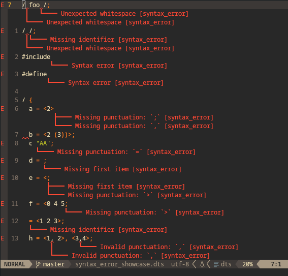
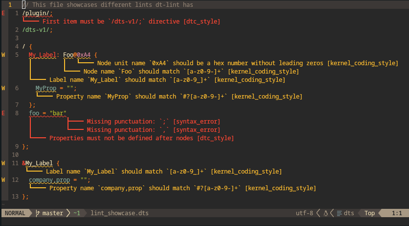

# Devicetree tools

> 🚧 NOTE: `dt-tools` is very experimental!

`dt-tools` helps you to write, debug and read Devicetree files more efficiently with advanced tooling!

* [IDE integration](#lsp)
* Linting
* Devicetree binding validation
* NOTE: only some basic preprocessor features are supported:
  * `#define`s can't take parameters and their expansion can only go in place
    of names, numbers, strings and cells

    TODO: add parametric macros

    e.g.
    ```dts
    // not allowed:
    #define MY_MACRO(a) a + 42

    #define SPECIAL_SYNTAX ) + (
    / {
      prop = (1 SPECIAL_SYNTAX 2);
    };

    // allowed:
    #define MAGIC_NUMBER 42
    #define MY_NODE_NAME foo
    #define MY_PROP_NAME bar
    #define MY_STRING "baz"
    #define MY_CELL <123 MAGIC_NUMBER>

    / {
      MY_NODE_NAME {
        MY_PROP_NAME = MY_CELL, MY_STRING;
      };
    };
    ```
  * `#include` can only be used outside of nodes
    So you can't do this:
    ```dts
    / {
    # include "my-file.dtsi"
    };
    ```
  * `#ifdef`, `#ifndef`, `#if`, `#else` and `#elif`
    * Can only be wrap nodes, properties and other preprocessor directives
    * They can't be used on property values and
    * `#if`, `#else` and `#elif` can only check for equality or ordering
* Possibly in the future:
  * Comparing DTS or DTB files
  * Comparing Android `dt` and `dtbo` partitions with `/sys/firmware/fdt`

## Crates

* `crates/dt-parser` implements an error-resistant parser inspired by rust-analyzer
* `crates/dt-analyzer` is a source file analyzer
* `crates/dt-lsp` is a [language server](https://code.visualstudio.com/api/language-extensions/language-server-extension-guide#why-language-server) for devicetree
* `crates/dt-lint` is a linter - currently only exposed to the LSP
* `crates/dt-binding-matcher` is a crate supposed to validate and match devicetree binding YAMLs

## Screenshots





## Help needed

* `crates/dt-binding-matcher` could use a little help from the contributors of [dt-schema](https://github.com/devicetree-org/dt-schema)
* DTS generator
* Highlight address and size portions of `reg` property
* Code to gobble up directories of devicetree bindings. Currently hardcoded to search from
  `/home/axel/dev/mainlining/linux/Documentation/devicetree/bindings` and
  `crates/dt-binding-matcher/dt-schema/dtschema`
  * Currently the schemas aren't stored in the binary and are looked up at runtime
  * Add a small cache with a list of matching `compatible` items for simple definitions or whole `select` JSON schemas
    along with the root binding documentation
* Take care of code containing `TODO`, `FIXME`, `todo!`, `unimplemented!` or similar
* Use arena for allocating the tree(?)
  * <https://www.cs.cornell.edu/~asampson/blog/flattening.html>
  * <https://github.com/saschagrunert/indextree>
  * I'll need a mutable normally allocated tree as well
* Use SmallVec for GreenNode's children
* A good and correct way to to get YAML file offsets from JSON Schema
  * The easiest way would be with just the [schema path](https://docs.rs/jsonschema/latest/jsonschema/error/struct.ValidationError.html#structfield.schema_path), but I think it could lead to incorrect positions
  * I'll need a YAML parser in Rust that can reverse paths to file offsets to make LSP integration work
* Fork [json-schema-rs](https://github.com/stranger6667/jsonschema-rs) or contribute upstream to add a way to
  1. Add meta-schemas more efficiently than calling `.insert` [a bunch of times](https://docs.rs/jsonschema/latest/src/jsonschema/compilation/options.rs.html#569)
  2. Add spans to error reporting?
  3. Maybe roll out a custom solution so we don't have to fixup everywhere and to support [`phandle: true`](https://github.com/devicetree-org/dt-schema/blob/5fdf9654d5069ef0ec430525d98cf3c04086405d/dtschema/schemas/types.yaml#L331)?
  4. Make its error reporting at least output file information (`$id` and `$ref`)

## Testing

`dt-tools` has extensive unit and integration tests, written in Rust. Here's how you can run them!

1. Install [Rust](https://www.rust-lang.org/learn/get-started)
2. Clone this repo:
   ```sh
   git clone --recurse-submodules https://github.com/axelkar/dt-tools.git dt-tools
   cd dt-tools
   ```
3. Run some commands:
   ```sh
   cargo test # Run unit and integration tests
   # Showcase parser output
   cargo run --example test_parser ./crates/dt-parser/a.dts
   cargo run --example test_parser ./syntax_error_showcase.dts
   # Showcase analyzer output
   cargo run --example test_analyzer ./syntax_error_showcase.dts
   ```

## LSP

The language server is currently only packaged for Neovim with the `./crates/dt-lsp/lsp.lua` script.

```sh
cd ./crates/dt-lsp
nvim -S lsp.lua ../../lint_showcase.dts
```

Features:

* Fast and safe parser and linter
* (TODO) View binding documentation straight from DTS!
* (TODO) Binding errors integrated into linter

## Contributing patches

Please first make sure that you have not introduced any regressions and format the code by running the following commands at the repository root.
```sh
cargo fmt
cargo clippy
cargo test
```

You can either make a GitHub [pull request](https://github.com/axelkar/dt-tools/pulls) or email me directly:

0. Setup `git send-email`:

   <https://git-send-email.io/>

1. Commit your changes, this will open up a text editor

   `git commit`

2. Send your patches to me. The command sends the last commit

   `git send-email --to="axel@axka.fi" HEAD^`

## License

Licensed under either of

 * Apache License, Version 2.0
   ([LICENSE-APACHE](LICENSE-APACHE) or <http://www.apache.org/licenses/LICENSE-2.0>)
 * MIT license
   ([LICENSE-MIT](LICENSE-MIT) or <http://opensource.org/licenses/MIT>)

at your option.

Unless you explicitly state otherwise, any contribution intentionally submitted
for inclusion in the work by you, as defined in the Apache-2.0 license, shall be
dual licensed as above, without any additional terms or conditions.
