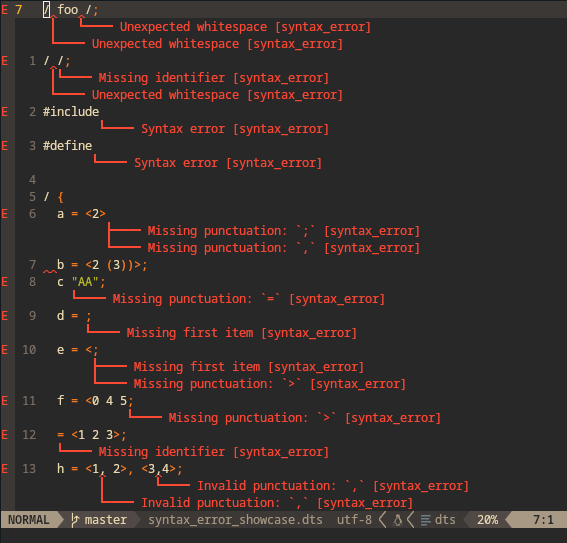
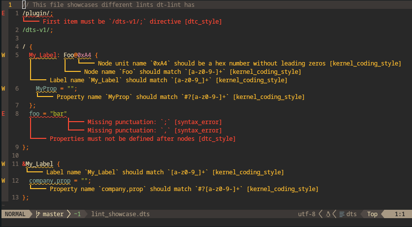

# Devicetree tools

> 🚧 NOTE: `dt-tools` is experimental

`dt-tools` helps you to write, debug and read Devicetree files more efficiently with advanced tooling!

* [IDE integration](#lsp)
* Linting
* Devicetree binding validation
* Preprocessor features with some restrictions:
  + Macros can only substitute references (`&`-syntax), name definitions of nodes, properties and labels, property values, cell values, nodes and properties.
  + Macros must be individually parseable. This is not allowed:
    ```dts
    #define SPECIAL_SYNTAX ) + (
    #define SUM1 1 + 2
    #define SUM2 (1 + 2)

    / {
      prop = (1 SPECIAL_SYNTAX 2);
      equal = (SUM1 * 2), (SUM2 * 2); // The C preprocessor would not evaluate these to the same value
    };
    ```
  + `#include` directives can only be used outside of nodes (🚧 note that this may change)
  + Conditionals can only wrap nodes, properties and other preprocessor directives
* Extensive unit and integration tests written in Rust
* Possibly in the future:
  + Comparing DTS or DTB files
  + Comparing Android `dt` and `dtbo` partitions with `/sys/firmware/fdt`

## Crates

* [`dt-tools-parser`](crates/dt-tools-parser) implements an error-resistant parser inspired by rust-analyzer
* [`dt-tools-analyzer`](crates/dt-tools-analyzer) is a source file analyzer
* [`dt-tools-lsp`](crates/dt-tools-lsp) is a [language server](https://code.visualstudio.com/api/language-extensions/language-server-extension-guide#why-language-server). It basically adds IDE support.
* [`dt-tools-lint`](crates/dt-tools-lint) is a linter for DTS
* [`dt-tools-binding`](crates/dt-tools-binding) is a crate supposed to validate and match devicetree binding YAMLs

## Screenshots





## Help needed

Any kinds of contributions are welcome! Just spreading awareness helps!

See the [GitHub issues](https://github.com/axelkar/dt-tools/issues), especially the ones tagged with `help wanted` or `good first issue`.

If you can, take care of code containing `TODO`, `FIXME`, `todo!(`, `unimplemented!(` or similar

## Contributing

Please read [CONTRIBUTING.md](CONTRIBUTING.md).

## LSP

The VSCode extension's documentation can be found [here](vscode/README.md).

The language server is also packaged for Neovim with the Lua script in `./crates/dt-tools-lsp/lsp.lua`.

```sh
cargo build -p dt-tools-lsp
nvim --cmd 'luafile ./crates/dt-tools-lsp/lsp.lua' lint_showcase.dts
```

Features:

* Fast and safe parser and linter
* (TODO) View binding documentation straight from DTS!
* (TODO) Binding errors integrated into linter

## License

Licensed under either of

 * Apache License, Version 2.0
   ([LICENSE-APACHE](LICENSE-APACHE) or <http://www.apache.org/licenses/LICENSE-2.0>)
 * MIT license
   ([LICENSE-MIT](LICENSE-MIT) or <http://opensource.org/licenses/MIT>)

at your option.

## Contributions

Unless you explicitly state otherwise, any contribution intentionally submitted
for inclusion in the work by you, as defined in the Apache-2.0 license, shall be
dual licensed as above, without any additional terms or conditions.
