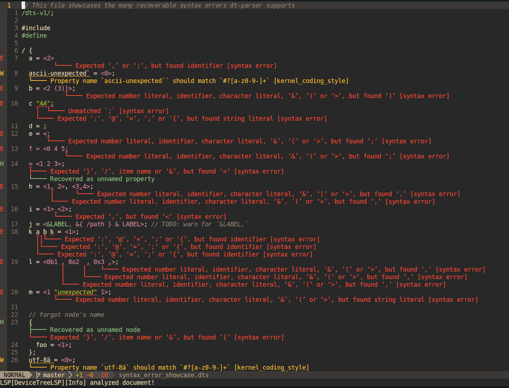
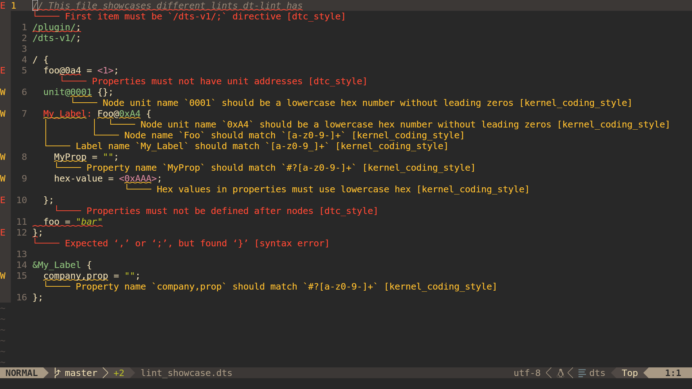

# Devicetree tools

> 🚧 NOTE: `dt-tools` is very experimental and is currently ongoing a rewrite!

`dt-tools` helps you to write, debug and read Devicetree files more efficiently with advanced tooling!

* [IDE integration](#lsp)
* Linting
* Devicetree binding validation
* Preprocessor features, with some restrictions:
  + Macros can only substitute references (`&`-syntax), name definitions (of nodes, properties and labels), property values, cell values and items (like nodes and properties)
  + Macros must be parseable on their own. This is not allowed:
    ```dts
    #define SPECIAL_SYNTAX ) + (

    / {
      prop = (1 SPECIAL_SYNTAX 2);
    };
    ```
  + `#include` directives can only be used outside of nodes (note that this may change)
  + Conditionals can only wrap nodoes, properties and other preprocessor directives
    - 🚧 Currently fully unimplemented
    - Can only check for definition, equality or ordering
* Extensive unit and integration tests written in Rust
* Possibly in the future:
  + Comparing DTS or DTB files
  + Comparing Android `dt` and `dtbo` partitions with `/sys/firmware/fdt`

## Crates

* [`dt-parser`](crates/dt-parser) implements an error-resistant parser inspired by rust-analyzer
* [`dt-analyzer`](crates/dt-analyzer) is a source file analyzer
* [`dt-lsp`](crates/dt-lsp) is a [language server](https://code.visualstudio.com/api/language-extensions/language-server-extension-guide#why-language-server) for devicetree
* [`dt-lint`](crates/dt-lint) is a linter for DTS
* [`dt-binding-matcher`](crates/dt-binding-matcher) is a crate supposed to validate and match devicetree binding YAMLs

## Screenshots





## Help needed

Any kinds of contributions are welcome! Just spreading awareness helps!

See the [GitHub issues](https://github.com/axelkar/dt-tools/issues), especially the ones tagged with `help wanted` or `good first issue`.

If you can, take care of code containing `TODO`, `FIXME`, `todo!(`, `unimplemented!(` or similar

## Contributing

Please read [CONTRIBUTING.md](CONTRIBUTING.md).

## LSP

The VSCode extension's documentation can be found [here](vscode/README.md).

The language server is also packaged for Neovim with the `./crates/dt-lsp/lsp.lua` script.

```sh
cd ./crates/dt-lsp
nvim -S lsp.lua ../../lint_showcase.dts
```

Features:

* Fast and safe parser and linter
* (TODO) View binding documentation straight from DTS!
* (TODO) Binding errors integrated into linter

## License

Licensed under either of

 * Apache License, Version 2.0
   ([LICENSE-APACHE](LICENSE-APACHE) or <http://www.apache.org/licenses/LICENSE-2.0>)
 * MIT license
   ([LICENSE-MIT](LICENSE-MIT) or <http://opensource.org/licenses/MIT>)

at your option.

Unless you explicitly state otherwise, any contribution intentionally submitted
for inclusion in the work by you, as defined in the Apache-2.0 license, shall be
dual licensed as above, without any additional terms or conditions.
